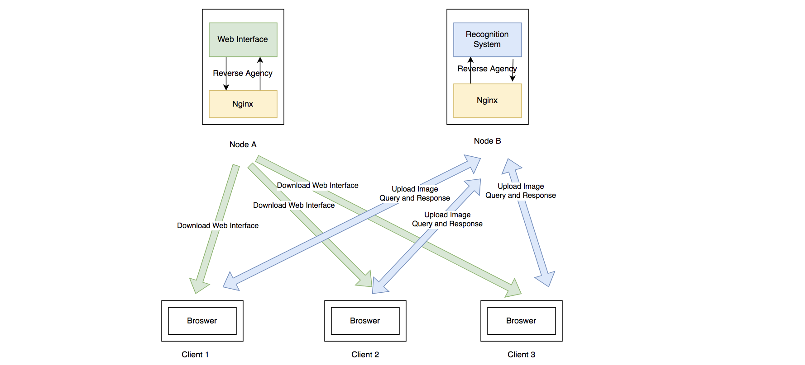
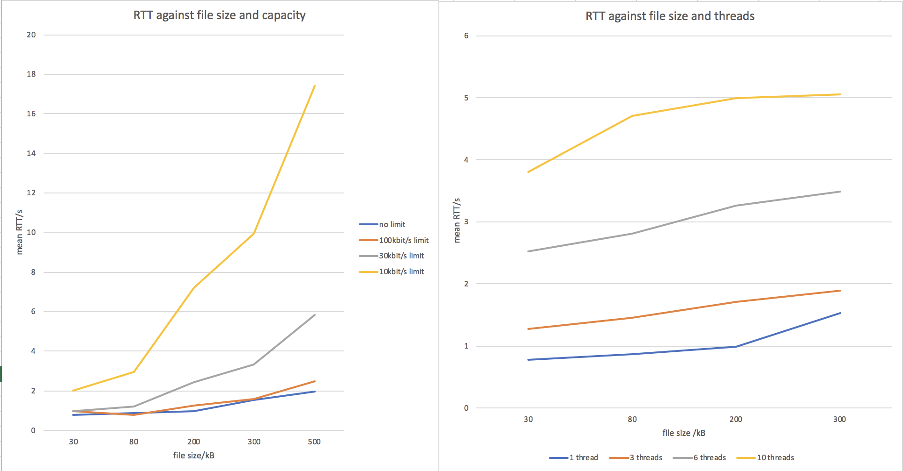

### Mini GENI Project: Image Recognition Application

Peng Huang phuang@bu.edu Repo [github.com/pblwk/mgp](github.com/pblwk/mgp)  Slice [mini4](https://portal.geni.net/secure/slice.php?slice_id=e4f16380-bbad-4901-a24d-402cc4c57aed)   Link: [http://143.215.216.206](http://143.215.216.206)

#### Introduction

**Definition** 

I designed a multi-thread image recognition application program. It consists of two parts, the web interface and the recognition system, deployed on separate nodes. The neural network model I use is SqueezeNet, which is pretrained on ImageNet. Users can upload an image (e.g., a goldfish image) through the web interface to the recognition system. Then the recognition system will return the classification of the image (e.g., "goldfish"). The protocol between the web interface and the recognition system is RESTful HTTP. The framework of the server is Spring. I employed Nginx as the reverse agency of the recognition system. The recognition system can also bear the concurrency of up to 10 requests from different clients.

I also finished the measurement experiments about the impact of capacity, concurrency and file size on the throughput and RTT. 

**Motivation/Learning Outcomes**

1) Full-stack programming           6) Design of GENI nodes deployment
2) Spring framework                     7) Evaluation of throughput and RTT
3) Deeplearning4j library for AI   8) Multi-Thread and Concurrency Design
4) RESTful API Design                    9) Dependency Injection Design Pattern
5) Traffic Control                           10) Nginx Configuration and Reverse Agency

#### Experimental Methodology

**Setup Diagram and Architecture Description** 

The figure above illustrates the architectural design of the image recognition system. I use the Client/Server pattern to build this system. The figure shows that the web interface resources and the recognition system are deployed on separate nodes, evenly distributing the load pressure. In each node, the reverse agency Nginx transfers the request to the web interface and recognition system. 

Here is the workflow. (For simplicity, I omitted the connection establishment process) When a user starts to use the application, firstly, he inputs the URL of the web interface on Node A to the browser, and the browser will send a request to the Nginx in Node A. Then Nginx will respond to the request then send the web interface resources file (HTML, etc. ) to the client. Then the user will open the image to the browser and click the upload button. A request with the image will send to the Nginx on Node B. Next, the Nginx transfer the image file to the recognition system, and the recognition system will feed the image to the model and return the prediction result to the Nginx. Finally, Nginx will transfer the response to the client's browser.

**Development Resources** 

There are many resources and techniques used in the development process. The programming language I used for the recognition system is Java because Java delivers application portability and robust performance across many computing environments. I use the HTML/JavaScript language to build the web interface. HTTP Protocol is used as a communication technique between the client and server. I use the famous framework, Spring, as the main configuration of the recognition system. Nginx serves as the reverse agency. Finally, I used the Deeplearning4j library for the AI part and pretrained the SqueezeNet model to recognize images.

**Experiment Environment** 

I designed an experiment to evaluate the impact of file size, concurrency and capacity on RTT. I use a multi-thread Python script to send requests simultaneously to simulate concurrency. I use traffic control to limit the rate to simulate different network capacities. I also use files of various sizes to simulate requests of different loads. 

The web interface and recognition system are deployed on GaTech GENI Nodes separately. The client is connected to the Boston University Library WLAN. The experiment was conducted at 6:30 PM on December 8th. The OS of the nodes is Linux, and the OS of the Client is Mac OS 10.12. 

#### Results

##### Application Usage Instructions
Please visit [http://143.215.216.206](http://143.215.216.206) and upload an image (no more than 200kB). The classification result will be shown. For a better demo effect, I recommend you use these sample images at http://github.com/pblwk/samples .

##### Experiment Result Analysis

| kB   | no limit   | 100kbit/s limit | 30kbit/s limit | 10kbit/s limit |
| ---- | ---------- | --------------- | -------------- | -------------- |
| 30   | 0.77755992 | 0.995713965     | 0.95647249     | 2.03301044     |
| 80   | 0.87344561 | 0.791679462     | 1.20280255     | 2.97155883     |
| 200  | 0.9861547  | 1.235466242     | 2.43022362     | 7.20011657     |
| 300  | 1.52540213 | 1.576978318     | 3.3268178      | 9.9597774      |
| 500  | 1.97641897 | 2.487679164     | 5.83435469     | 17.428836      |

The left figure and the table above display the impact of different sizes and capacities on RTT. In this experiment, the primary impact factor and the performance bottleneck are on data transmission. According to the formula, RTT = minRTT + file_size/capacity; the larger the file size, the larger the RTT. The smaller the file size, the larger the RTT. However, we also observed that the RTT is almost the same for the unlimited case and limited 100kbit/s on the server-side case. The client's upload speed has become the main bottleneck limiting the RTT.

| kB   | 1 thread   | 3 threads   | 6 threads  | 10 threads |
| ---- | ---------- | ----------- | ---------- | ---------- |
| 30   | 0.77755992 | 1.274289799 | 2.52399823 | 3.7975863  |
| 80   | 0.87344561 | 1.459996208 | 2.81043376 | 4.71380704 |
| 200  | 0.9861547  | 1.711879857 | 3.26518874 | 4.9983619  |
| 300  | 1.52540213 | 1.898226145 | 3.48324508 | 5.04889754 |

The right figure and the table above display the impact of different sizes and concurrency on RTT. Due to the increase in concurrency, the average processing time of the recognition system has increased significantly, and the waiting time for request queuing has also increased accordingly. According to Little's Law, L=λW, arrival rate λ (or throughput) increases, and the average number of customers waiting in line will increase accordingly. Thus the RTT also increases.

At the same time, this experiment also proves that the server program I designed can deal with multiple concurrencies.

#### Conclusion
**Findings** 

I find that not only do file size and network capacity impact RTT, but concurrency also significantly influences RTT. When the parallel processing capability of the server is weak, high concurrency will cause severe delays. This is why dealing with high concurrency is the focus and difficulty of server design. And I also found that deploying applications on two nodes is beneficial to reduce the load on a single server compared to a single node, which is the advantage of distributed design in server design.

**Possible Extensions** 

I have two possible extensions for future work. First, I consider increasing the number of recognition system nodes, which can further improve the ability to handle high concurrency. Secondly, I can consider caching techniques to cache the results of the recognized pictures in the proxy server, which can reduce the workload of the recognition system.

#### 